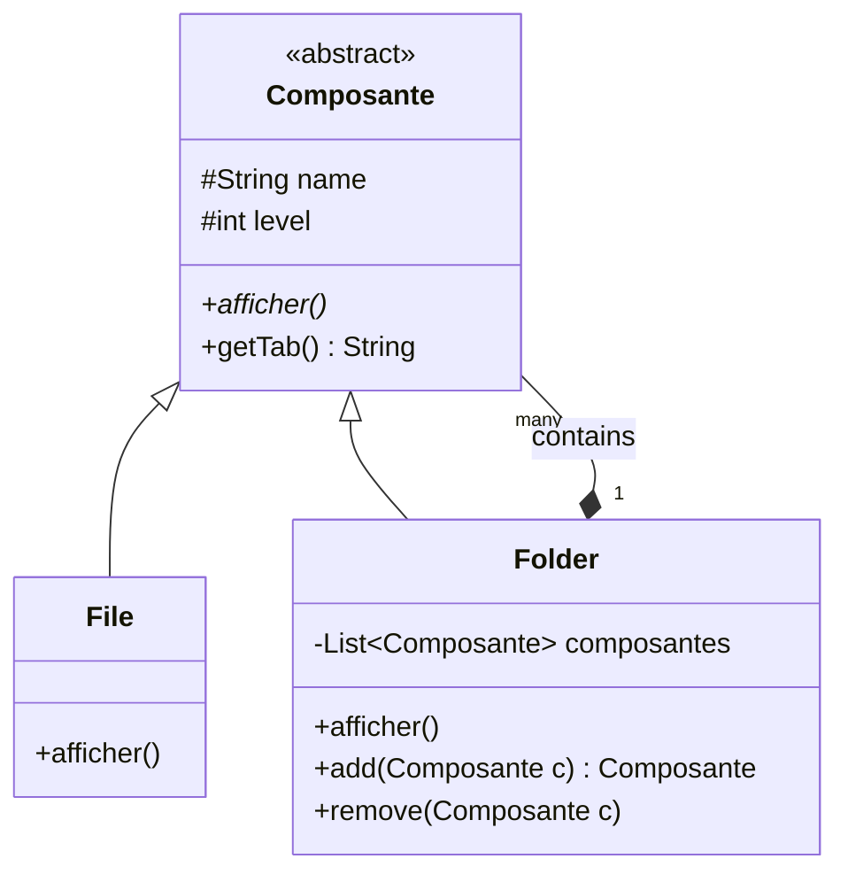

# Pattern Composite - File System Emulation

A professional implementation of the **Composite Design Pattern** in Java, emulating a hierarchical file system structure with Folders and Files.

## 📌 Overview

This project demonstrates the **Composite Pattern**, a structural design pattern that lets you compose objects into tree structures to represent part-whole hierarchies. Composite lets clients treat individual objects and compositions of objects uniformly.

In this implementation:
- **`Composante`**: The base component (abstract class) defining the shared interface.
- **`File`**: The leaf object representing individual files.
- **`Folder`**: The composite object that can contain both files and other folders.

## 🏗️ Architecture

The following class diagram illustrates the relationship between the components:



## 🚀 Features

- **Recursive Structure**: Easily create deeply nested folder and file hierarchies.
- **Uniform Treatment**: Display the entire structure starting from any node (root or sub-folder) using a single method call.
- **Indentation Support**: Automatic indentation based on the depth level for clear visual representation.

## 💻 Tech Stack

- **Language**: Java 17
- **Build Tool**: Maven

## 🛠️ Getting Started

### Prerequisites
- JDK 17 or higher
- Apache Maven

### Installation
1. Clone the repository:
   ```bash
   git clone https://github.com/LAMBARAA-Abdellah/Pattern-composite.git
   ```
2. Navigate to the project directory:
   ```bash
   cd Pattern-composite
   ```

### Running the Example
Compile and run the `Test` class to see the file system structure in action:
```bash
mvn compile
mvn exec:java -Dexec.mainClass="Test"
```

## 📝 Example Output
```text
- Folder : Root
	- File => Java.txt
	- File => pom.xml
	- Folder : src
		- File => data.csv
		- File => config.txt
		- Folder : org
			- File => data.bin
		- File => config2.txt
```

---
*Created as part of the Master BDCC - Systèmes Distribués et DevOps curriculum.*
